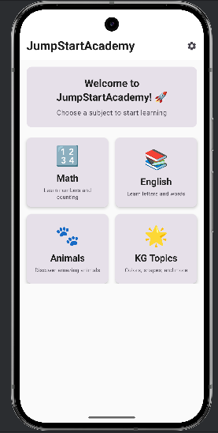
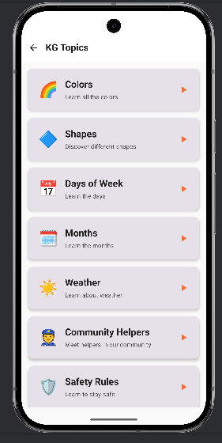
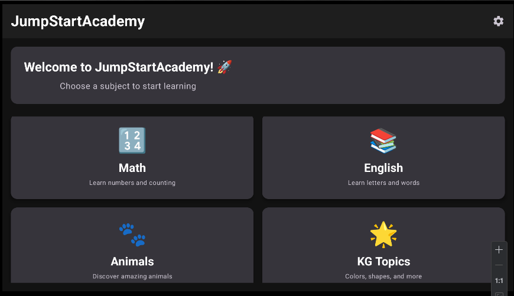
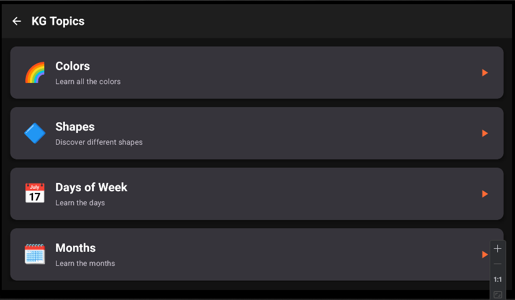

# BrightSprouts - Pre-K to KG Learning App

A beautiful, educational Android and Android TV app designed for children ages 3-6, covering Math, English, Animals, and Kindergarten topics.

## 🌟 Features

- **Multi-Platform Support**: Works on Android phones, tablets, and Android TV
- **Offline-First**: All content works without internet connection
- **Kid-Friendly Design**: Large touch targets, friendly colors, and intuitive navigation
- **Educational Content**: 
  - Math: Counting, shapes, basic arithmetic
  - English: Letters, phonics, sight words, tracing
  - Animals: Farm, wild, ocean animals with sounds and facts
  - KG Topics: Colors, days, months, community helpers, safety
- **Rewards System**: Stickers, stars, and progress tracking
- **Parental Controls**: Settings dashboard with PIN protection
- **Accessibility**: TalkBack support, large text, reduced motion options

## 🏗️ Architecture

- **Clean Architecture** with MVVM pattern
- **Jetpack Compose** for modern UI
- **Compose for TV** for Android TV interface
- **Room Database** for local data storage
- **DataStore** for preferences
- **Hilt** for dependency injection
- **Material 3** design system

## 📱 Project Structure

```
brightsprouts/
├── app/                    # Mobile app module
├── tv/                     # Android TV app module
├── core/                   # Domain models and use cases
├── data/                   # Repositories and data sources
├── design/                 # Theme, typography, and design tokens
├── feature-math/           # Math lessons and UI
├── feature-english/        # English lessons and UI
├── feature-animals/        # Animal lessons and UI
├── feature-kg/             # Kindergarten topics and UI
├── testing/                # Test utilities and fixtures
└── content/                # JSON content and assets
```

## 🚀 Getting Started

### Prerequisites

- Android Studio Hedgehog or later
- JDK 8 or later
- Android SDK 24+ (Android 7.0)
- Target SDK 35 (Android 15)

### Installation

1. Clone the repository:
```bash
git clone https://github.com/yourusername/brightsprouts.git
cd brightsprouts
```

2. Open the project in Android Studio

3. Sync the project with Gradle files

4. Build and run:
```bash
# For mobile app
./gradlew :app:installMobileDebug

# For Android TV app
./gradlew :tv:installTvDebug
```

## 🎮 Usage

### Mobile App
- Launch the app and explore different learning categories
- Tap on lessons to start learning
- Complete exercises to earn stars and stickers
- Access settings through the gear icon

### Android TV App
- Use the D-pad to navigate between categories
- Press the center button to select lessons
- Use the back button to return to previous screens

## 🧪 Testing

Run the test suite:
```bash
./gradlew test
./gradlew connectedAndroidTest
```

## 📦 Building for Release

1. Generate signed APKs:
```bash
./gradlew assembleMobileRelease
./gradlew assembleTvRelease
```

2. Generate App Bundles:
```bash
./gradlew bundleMobileRelease
./gradlew bundleTvRelease
```

## 🎨 Design System

The app uses a kid-friendly design system with:
- **Colors**: Warm, friendly palette with high contrast
- **Typography**: Rounded, readable fonts
- **Touch Targets**: Minimum 56dp for accessibility
- **Spacing**: Consistent 8dp grid system
- **Animations**: Springy, 200-300ms duration

## 🔒 Privacy & Safety

- **COPPA Compliant**: No personal data collection from children
- **Offline-First**: No network required for core functionality
- **Parental Gate**: Math-based verification for settings access
- **No Ads**: Clean, distraction-free learning environment

## 📚 Content Structure

Lessons are defined in JSON format with the following structure:

```json
{
  "id": "lesson_id",
  "domain": "MATH|ENGLISH|ANIMALS|KG",
  "title": "Lesson Title",
  "age": "3-4",
  "cards": [
    {
      "type": "prompt",
      "tts": "Text to speech content"
    },
    {
      "type": "choice",
      "image": "image.png",
      "options": ["Option 1", "Option 2", "Option 3"],
      "answer": 0
    }
  ],
  "rewards": {
    "stars": 3,
    "sticker": "sticker_id"
  }
}
```

## 🤝 Contributing

1. Fork the repository
2. Create a feature branch: `git checkout -b feature/amazing-feature`
3. Commit your changes: `git commit -m 'Add amazing feature'`
4. Push to the branch: `git push origin feature/amazing-feature`
5. Open a Pull Request

## 📄 License

This project is licensed under the MIT License - see the [LICENSE](LICENSE) file for details.

## 🆘 Support

For support, email support@JumpStartAcademy.com or create an issue in this repository.

## 🗺️ Roadmap

- [ ] **Interactive Lesson Player** - Full implementation with games, quizzes, and progress tracking
- [ ] **Spanish and Portuguese localization** - Multi-language support for global reach
- [ ] **Letter/number tracing with path detection** - Advanced handwriting practice
- [ ] **Cloud backup for progress** - Optional sync across devices
- [ ] **Multi-child profiles** - Individual progress tracking for families
- [ ] **Classroom mode for teachers** - Educational tools for schools
- [ ] **Dynamic difficulty adjustment** - AI-powered personalized learning
- [ ] **Voice recognition** - Speech practice and pronunciation feedback
- [ ] **Offline video lessons** - Rich multimedia content
- [ ] **Parent dashboard** - Detailed progress reports and insights

---

Made with ❤️ for young learners everywhere!

---

## 📱 Screenshots

### Mobile App

*Mobile App Home Screen*


*KG Topics Screen on Mobile*

### Android TV App

*Android TV App Home Screen*


*KG Topics Screen on Android TV*

